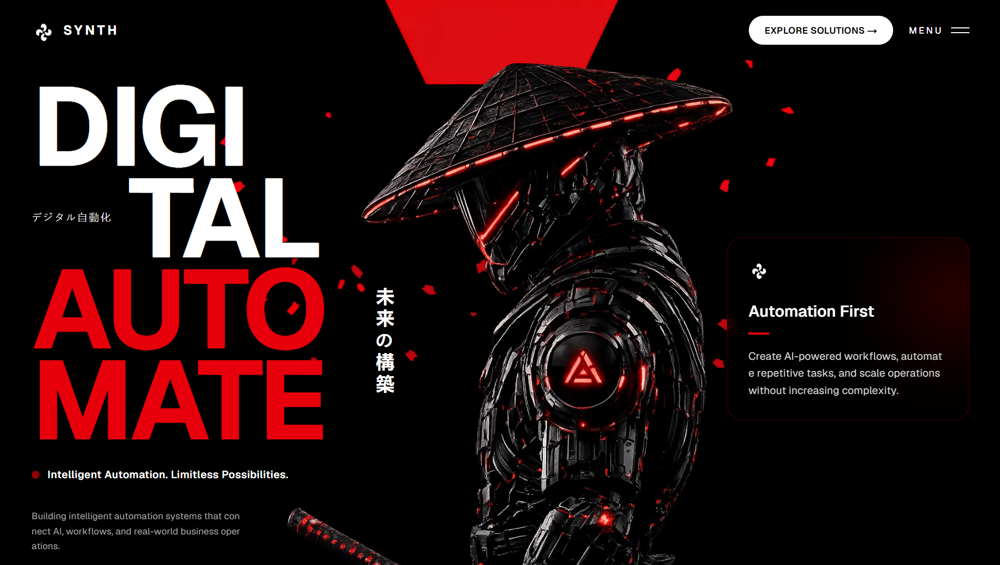

# SYNTH

SYNTH is a futuristic automation-focused landing page built with Next.js, React, TypeScript, and Tailwind CSS. The project presents AI systems, workflow automation services, case-study style work sections, impact metrics, testimonials, and a contact experience in a bold cyberpunk visual style.


Built by **Jagdish Prasad**.

## Overview

This project is a single-page marketing website for an automation and AI systems brand. It is designed to communicate service capability, credibility, and conversion intent through strong visuals, animated typography, metrics, project showcases, and lead capture UI.

## What The Project Includes

- A cinematic hero section with layered imagery, branding, and animated headline text
- A services section covering custom automation, AI integration, secure systems, optimization, end-to-end delivery, and scalability
- A stats and impact section with animated counters and a custom SVG chart
- A work showcase section featuring Voice AI Platform, AI Lead Engine, and Workflow Automation Suite
- A testimonial and client proof section with outcomes-focused cards and performance metrics
- A CTA and contact flow with modal-based forms for project inquiries and call booking
- A fullscreen animated menu overlay for section navigation

## Tech Stack

- `Next.js 16.2.9`
- `React 19.2.4`
- `TypeScript 5`
- `Tailwind CSS 4`
- `Motion 12.40.0`
- `lucide-react`
- `ESLint 9`
- `next/image` for optimized image handling
- `next/font` with Geist and Geist Mono

## Project Structure

```text
synth/
├─ app/
│  ├─ components/
│  ├─ favicon.ico
│  ├─ globals.css
│  ├─ icon.svg
│  ├─ layout.tsx
│  └─ page.tsx
├─ public/
│  ├─ hero/
│  ├─ section2/
│  ├─ section3/
│  ├─ section4/
│  ├─ section5/
│  ├─ cta/
│  └─ logo.png
├─ package.json
├─ next.config.ts
├─ tsconfig.json
└─ eslint.config.mjs
```

## Main UI Sections

### 1. Hero

The homepage opens with a dramatic branded layout using layered `next/image` assets, oversized interactive text, and a strong black-and-red color system to position SYNTH as a premium automation brand.

### 2. Services

The services section explains the core offering:

- Custom Automation
- AI Integration
- Reliable & Secure Systems
- Process Optimization
- End-to-End Solutions
- Scalable Systems

### 3. Stats And Impact

This section communicates business credibility with animated counters and custom visual components, including:

- `120+` automations deployed
- `3` solution tiers
- `20K+` hours automated
- `60+` happy clients

### 4. Work Showcase

Three featured solution blocks present the productized service direction of the brand:

- `Voice AI Platform`
- `AI Lead Engine`
- `Workflow Automation Suite`

### 5. Clients And Testimonials

The project includes testimonial cards, proof metrics, and trust-building content designed to highlight measurable outcomes such as qualified leads, conversations automated, and workflows improved.

### 6. Contact And Conversion

The final section supports conversion with:

- Scroll-based navigation
- CTA buttons
- A fullscreen menu overlay
- A modal-based contact form for projects and discovery calls

## Key Implementation Details

- Uses the `app/` directory and App Router architecture
- Uses client components for interactive UI like counters, hover effects, overlays, and modal state
- Uses `motion/react` for reveal and interaction animations
- Uses SVG-driven UI details for charts, icons, borders, and decorative effects
- Uses grouped assets in `public/` for section-based visual organization

## Local Development

### Install

```bash
npm install
```

### Run The Dev Server

```bash
npm run dev
```

### Create A Production Build

```bash
npm run build
```

### Start Production

```bash
npm run start
```

### Lint

```bash
npm run lint
```

## GitHub Details

- Repository: `https://github.com/developerjagdish/synth`
- GitHub owner: `developerjagdish`
- Project name: `synth`
- Primary branch: check your repository default branch on GitHub before deployment or collaboration

Clone with:

```bash
git clone https://github.com/developerjagdish/synth.git
cd synth
```

## Branding

The visual language centers around:

- Black backgrounds
- Red glow accents
- Futuristic typography
- Motion-heavy interactions
- Cyberpunk-inspired UI framing

## Author

**Jagdish Prasad**  
Creator and builder of the SYNTH project.
